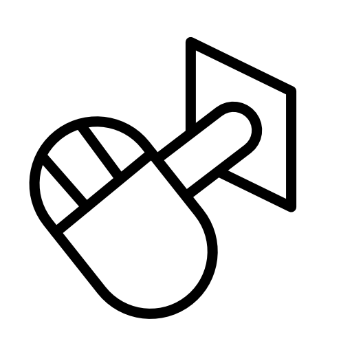

# Mouse Plunger

Super-basic mouse control for the plunger in Visual Pinball X using VJoy.

## Setup

### Install and configure vJoy

Install VJoy: https://github.com/njz3/vJoy/releases

Use the Configure vJoy application to create a controller with a Z axis. Other axes and buttons are optional and won't be used by mouse-plunger.

### Install Mouse Plunger app

Download and extract the latest release: https://github.com/Billiam/mouse-plunger/releases

Copy `vJoyInterface.dll` from the vjoy install directory to the mouse-plunger directory

Run mouse-plunger.exe

You can use vJoy's Monitor application to verify that the Z axis is working correctly.

In Visual Pinball X, configure the controls to use the Z axis for the plunger (this is the default configuration).

## Usage

After installation, whenever the mouse button is pressed, and then the mouse pulled down backward, the vJoy Z axis will be updated.

Release the mouse button to release the plunger.